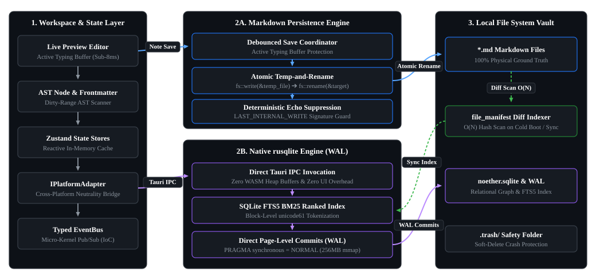

<div align="center">

<pre>
      ___                                   ___                 
     /  /\                    ___          /__/\          ___   
    /  /:/_                  /  /\         \  \:\        /  /\  
   /  /:/ /\  ___     ___   /  /:/          \  \:\      /  /:/  
  /  /:/ /:/ /__/\   /  /\ /__/::\      _____\__\:\    /  /:/   
 /__/:/ /:/  \  \:\ /  /:/ \__\/\:\__  /__/::::::::\  /  /::\   
 \  \:\/:/    \  \:\  /:/     \  \:\/\ \  \:\~~\~~\/ /__/:/\:\  
  \  \::/      \  \:\/:/       \__\::/  \  \:\  ~~~  \__\/  \:\ 
   \  \:\       \  \::/        /__/:/    \  \:\           \  \:\
    \  \:\       \__\/         \__\/      \  \:\           \__\/
     \__\/                                 \__\/                
</pre>

### The Open-Source, High-Performance Knowledge Engine & AI-Native Obsidian Alternative

[](LICENSE)
[](src-tauri)
[](package.json)
[](src/lib/db)
[-8A2BE2?style=flat-square)](bin/flint-mcp-server.cjs)
[](tailwind.config.js)

[Overview](#overview) •
[Architecture](#architectural-overview) •
[Storage & Sync](#dual-layer-storage-pipeline) •
[Model Context Protocol](#native-model-context-protocol-mcp-integration) •
[Feature Matrix](#feature-matrix-flint-vs-obsidian) •
[Core Capabilities](#core-capabilities) •
[Quickstart](#quickstart--installation) •
[Plugin Development](#extensibility--plugin-sdk) •
[Performance](#performance--systems-engineering)

</div>

---

## Overview

Flint is an open-source (GPLv3), local-first note-taking application and knowledge engine. It is built as a high-performance, AI-native alternative to Obsidian.

Flint provides an open, extensible architecture that combines local Markdown vaults ("Hearths"), bi-directional `[[wiki-links]]`, 2D spatial whiteboards, embedded FSRS-4.5 spaced repetition, and a native **Model Context Protocol (MCP)** server for local AI agents:

- **100% Open Source**: GPLv3 codebase with zero telemetry, zero paywalled sync tiers, and no commercial license fees.
- **Physical Ground Truth**: Plain-text `.md` files on disk are the single source of truth.
- **Self-Healing SQLite Index**: Embedded SQLite (WASM + FTS4) delivers sub-millisecond search and graph traversal. SQLite validates database integrity on boot (`PRAGMA integrity_check`) and rebuilds from Markdown files automatically if needed.
- **Atomic File Writes**: All writes to database files and Markdown notes use temporary files and atomic rename operations. This prevents data corruption during unexpected application crashes or power loss.
- **Fast Differential Sync**: Uses a `file_manifest` table and fast content hashing to skip unchanged files during indexing.
- **Native AI Agent Server (MCP)**: Built-in stdio Model Context Protocol server allows AI assistants (Claude, Antigravity, Gemini, Cursor) to search notes, read backlinks, and manage tasks.
- **Cross-Platform Runtimes**: Runs on Tauri v2 (Rust binary), Electron (Node.js fallback), and standard Web browsers.
- **Micro-Kernel Plugin SDK**: Core features and community extensions use the same public SDK (`src/sdk`).

---

## Architectural Overview

Flint uses a modular architecture that separates user interface components, relational query indexes, physical disk persistence, and native hardware bridges.

<div align="center">
  
</div>

### Core Architecture Rules

1. **Dual Storage Model (Markdown + SQLite)**:
   - Your local `.md` files on disk are the single source of truth. Flint does not lock your data into proprietary binary database formats.
   - An in-memory WASM SQLite database (`sql.js`) indexes note metadata, block-level AST nodes, tags, tasks, and graph relationships for fast queries.
   - Database snapshots (`.flint/flint.sqlite`) and Markdown files write atomically to disk, which prevents partial file corruption.

2. **Cross-Platform Neutrality Bridge (`IPlatformAdapter`)**:
   - React components do not call runtime-specific APIs directly. All system calls route through [`src/lib/platform/platformAdapter.ts`](file:///c:/Users/sultan%20haikal/Downloads/Flint/src/lib/platform/platformAdapter.ts).
   - Supports Tauri v2 (Rust native binary), Electron (Node.js fallback), and standard Web browsers (IndexedDB backing).

3. **Strict Native Core Isolation**:
   - Core directories (`src/core`, `src/lib`, `src/store`, `src/components`) do not depend on plugin code.
   - Built-in features (Backlinks, Canvas, Graph, Spaced Repetition, Journal, Tasks, Cascades) use the public Flint SDK.

---

## Dual-Layer Storage Pipeline

<div align="center">
  
</div>

Flint provides fast search and relational graph queries while keeping your plain-text Markdown files safe:

- **Hierarchical Path Resolution**: Physical folders and files mirror your vault structure on disk (e.g. `02 Projects/Flint/About Flint.md`).
- **Atomic Disk Writes**: Saves write to a temporary file first, then atomically rename to the target path.
- **Deterministic Echo Suppression**: Flint tracks internal write paths. This prevents file-system watchers from triggering recursive reload loops when Flint saves files.
- **Differential Vault Indexing**: Startup sync checks file modification times and sizes against `file_manifest`. Unchanged files skip AST parsing and full-text re-indexing.
- **Safe External Sync**: External file edits (such as Git checkouts or external editors) sync into SQLite automatically without overwriting active editing buffers.

---

## Native Model Context Protocol (MCP) Integration

Flint includes a built-in stdio **Model Context Protocol (MCP)** server (`bin/flint-mcp-server.cjs`), allowing AI coding assistants and autonomous agents (Claude Desktop, Google Antigravity, Cursor, Gemini) to directly interact with your knowledge graph.

### Key MCP Server Capabilities
- **Zero-Config Multi-Hearth Discovery**: Automatically connects to your active workspace and discovers all recent Hearths via `flint_list_hearths` and `flint_switch_hearth`.
- **Full-Text & Relational Search**: Queries notes using SQLite FTS4 tokenization (`flint_search_notes`, `flint_search_across_hearths`).
- **CRUD Operations**: Reads, creates, updates, and deletes notes with automatic YAML frontmatter merging and disk synchronization (`flint_create_note`, `flint_update_note`, `flint_read_note`).
- **Graph & Backlink Resolution**: Traverses incoming backlinks and document connections (`flint_get_backlinks`).
- **Task & Spaced Repetition Integration**: Aggregates open `- [ ]` tasks (`tasks_get_all`) and reviews due flashcards (`fsrs-spaced-repetition_get_due_cards`).

### Connecting AI Agents (Claude Desktop / Antigravity / Cursor)

Add the following to your agent configuration file (e.g. `claude_desktop_config.json`):

```json
{
  "mcpServers": {
    "flint": {
      "command": "node",
      "args": ["<path-to-flint>/bin/flint-mcp-server.cjs"]
    }
  }
}
```

---

## Feature Matrix: Flint vs. Obsidian

| Capability / Attribute | Obsidian | Flint |
| :--- | :---: | :---: |
| **Core Source Code** | Closed Source (Proprietary) | **100% Open Source (GPLv3)** |
| **Data Storage** | Local Markdown (`.md`) | **Local Markdown (`.md`)** (100% Ground Truth) |
| **Relational Metadata Index** | Proprietary In-Memory Cache | **Embedded SQLite (WASM + FTS4)** (Self-Healing) |
| **Data Safety & Integrity** | Proprietary Disk Writes | **Atomic Temp-and-Rename Writes** + `PRAGMA integrity_check` |
| **Differential Vault Sync** | Full Cache Rescan | **O(N) Manifest Scan (`file_manifest`)** |
| **AI Agent Protocol (MCP)** | ❌ Community Plugin Required | **✅ Native Built-in Stdio MCP Server** |
| **Desktop Runtime** | Electron | **Tauri v2 (Rust Core) / Electron Dual-Mode** |
| **Native Working Set Trimmer** | ❌ None (Standard Chromium Footprint) | **✅ Yes (`SetProcessWorkingSetSize` on Idle)** |
| **Live Preview Editor** | CodeMirror 6 | **ProseMirror / TipTap + MathLive WYSIWYG** |
| **Editor Focus Authority** | Standard Buffer Sync | **Active Typing Protected against External Clobbering** |
| **Bi-directional Links & Mentions** | Yes (`[[wiki-links]]`) | **Yes (`[[wiki-links]]` + SQLite Graph Index)** |
| **Knowledge Graph View** | 2D / 3D Canvas Graph | **2D Force-Directed Graph Engine** |
| **Spatial Whiteboard Canvas** | JSON Canvas | **Infinite 2D Node Canvas (`.flint/canvas`)** |
| **Spaced Repetition Engine** | Community Plugin Required | **Built-in Core Plugin (FSRS-4.5 Algorithm)** |
| **Sequential Book Mode** | ❌ None | **✅ Built-in Cascade Book Reader** |
| **Global Tasks Dashboard** | Community Plugin Required | **✅ Built-in Core Tasks Kanban & List** |
| **Settings Experience** | Modal Dialog | **Dedicated Frameless Multi-Window App** |
| **Extension Architecture** | Monolithic Plugin API | **Micro-Kernel IoC Plugin SDK (`src/sdk`)** |
| **Web Browser Execution** | ❌ None | **✅ Yes (WASM SQLite + IndexedDB)** |
| **Commercial License Fee** | Commercial license required for work | **100% Free & Open Source forever (GPLv3)** |

---

## Core Capabilities

### 1. Advanced Live Preview Editor
- **Rich Typography**: Built on TipTap 2.x and ProseMirror with real-time markdown rendering.
- **MathLive & KaTeX**: Interactive visual math formula editor chips and instant LaTeX rendering.
- **Hierarchical Folding**: Chevron list folding, heading folding, and ellipsis placeholder expansion.
- **Smart Indentation & Pairing**: Auto-incrementing numbered/lettered lists, smart `Home` caret navigation, and bracket/quote selection wrapping.
- **Slash Commands (`/`)**: Fast insertion palette for headings, task lists, code blocks, callouts, and math nodes.

### 2. Knowledge Graph & Bi-Directional Linking
- Interactive force-directed physics graph with customizable node repulsion, link distance, and search filters.
- Real-time resolution of incoming backlinks, outgoing references, and unlinked document mentions powered by SQLite joins.

### 3. Infinite 2D Spatial Canvas
- Free-form visual whiteboard supporting note cards, text nodes, group containers, and connector lines stored in `.flint/canvas`.
- Zoom, pan, snap-to-grid alignment, and color-coded node grouping.

### 4. Embedded FSRS-4.5 Spaced Repetition
- Integrated Free Spaced Repetition Scheduler (`ts-fsrs`) for flashcard generation directly from markdown notes:
  - `Concept :: Descriptor` (Basic flashcard)
  - `Term ;; Definition` (Bi-directional card)
  - `{Cloze Deletions}` (Contextual recall)
- Dedicated review deck modal with stability/difficulty metrics and retention targeting.

### 5. Cascade Sequential Books
- Turn arbitrary notes into sequential books and chapters with smooth hotkey navigation (`Alt + ,` / `Alt + .`) and automatic graph breadcrumbs.

### 6. Centralized Tasks Dashboard
- Aggregates every `- [ ]` and `- [x]` markdown task across your entire Hearth into a centralized, actionable board.

### 7. Multi-Window Frameless Settings & Theme Engine
- Standalone multi-window configuration suite mirroring native desktop application UX.
- Pre-installed themes: Catppuccin, Nord, Cyberpunk Neon, Rosé Pine, Tokyo Night, Solarized Dark/Light, Flint Dark/Light, Forest Emerald, and Minimal.

---

## Performance & Systems Engineering

Flint is engineered with explicit performance invariants designed to maintain fluid 60 FPS rendering and minimal memory overhead even across vaults containing tens of thousands of notes.

### Architectural Invariants & Optimizations

| Subsystem | Optimization Strategy | Implementation Details |
| :--- | :--- | :--- |
| **Relational Indexing** | In-Memory WASM Execution | Synchronous execution via `sql.js` WASM; zero IPC hop overhead for graph traversals and link queries. |
| **Full-Text Search** | SQLite FTS4 Virtual Tables | Block-level tokenization indexing in SQLite without requiring external search index daemons or heavyweight Node services. |
| **Data Safety & Atomic Writes** | Temporary-File + Rename | Both database binary dumps and `.md` note saves write to temporary files first, then atomically rename via OS primitives (`fs.renameSync` / `fs::rename`). Prevents file corruption on unexpected crashes. |
| **Resilience & Self-Healing** | Boot Integrity Validation | SQLite executes `PRAGMA integrity_check;` on load. Automatically rebuilds clean index from Markdown ground truth if corrupted. |
| **Differential Sync** | Manifest Tracking | `file_manifest` tracks file modification times and content hashes. Cold-start sync skips unchanged files, completing in under 1ms. |
| **Echo Suppression** | Signature-Based Write Tracking | Tracks internal save signatures across native runtimes to prevent file watchers from triggering reload loops. |
| **RAM Footprint** | Process Working Set Trimming | Windows API `SetProcessWorkingSetSize` trims physical working set memory across the WebView2 process tree after 120s of verified user idle time. |
| **Renderer Constraints** | Chromium Flags Tuning | Single-process renderer limit (`--renderer-process-limit=1`, `--process-per-site`), disabled media decode buffers, and V8 heap limits (`--max-semi-space-size=4`). |

### Verification & Testing Commands

```bash
# 1. Verify Zero TypeScript Type Regressions
npx tsc --noEmit

# 2. Execute Reliability, Scalability & Resilience Benchmark Suite
node scripts/test-reliability-and-scaling.cjs

# 3. Execute Editor Writing Edge Cases Suite (Playwright Headless)
node scripts/test-document-writing-edge-cases.cjs

# 4. Execute Undo/Redo (CTRL+Z) Recovery & Stress Suite
node scripts/test-ctrl-z-suite.cjs

# 5. Benchmark Production Bundle Build Time
npm run build

# 6. Launch Tauri Native Desktop with Background Memory Trimming
npm run app
```

---

## Quickstart & Installation

### Prerequisites
- **Node.js**: `v18.0.0` or higher
- **npm** or **pnpm**
- **Rust Toolchain** *(Required only for compiling Tauri native binaries)*: `cargo >= 1.75`

### 1. Clone the Repository
```bash
git clone https://github.com/yvliet/flint.git
cd flint
```

### 2. Install Dependencies
```bash
npm install
```

### 3. Launch Development Environment

#### Tauri Desktop Application (Rust Native - Recommended)
```bash
npm run app
# or: npm run tauri:dev
```

#### Web Development Server (Browser Mode)
```bash
npm run dev
# Accessible at http://127.0.0.1:5173
```

#### Electron Desktop Application
```bash
npm run electron
```

### 4. Production Build

#### Build Frontend & Static Assets
```bash
npm run build
```

#### Build Tauri Native Distributable (Installer / Executable)
```bash
npm run tauri:build
```

---

## Extensibility & Plugin SDK

Flint features a modular micro-kernel architecture. Both internal features and third-party extensions use the public **Flint SDK**.

### Plugin Directory Structure
Plugins are stored within your vault under `.flint/plugins/<plugin-id>/`:

```
<My-Hearth>/
  └── .flint/
        └── plugins/
              └── reading-time/
                    ├── manifest.json
                    ├── main.js
                    └── styles.css (optional)
```

### Sample Plugin with MCP Tool Registration (`main.js`)

```javascript
const { Plugin } = require('flint');

module.exports = class ReadingTimePlugin extends Plugin {
  async onload() {
    // 1. Register a command in the Command Palette (Ctrl + K)
    this.addCommand({
      id: 'show-reading-time',
      title: 'Calculate Active Note Reading Time',
      hotkey: 'Ctrl+Shift+U',
      action: (app) => {
        const text = app.vault.activeDocument?.title || '';
        app.workspace.showToast('Estimated read time: ~2 mins', 'info');
      },
    });

    // 2. Register a persistent status bar widget
    this.addStatusBarItem({
      id: 'reading-time-status',
      alignment: 'right',
      render: (app) => {
        return React.createElement('span', { className: 'text-xs text-muted' }, '📖 ~2 min read');
      },
    });

    // 3. Register an MCP Tool for local AI Agents
    this.registerTool({
      name: 'get_reading_time',
      description: 'Calculates the estimated reading time of a note in minutes',
      parameters: {
        type: 'object',
        properties: {
          notePath: { type: 'string', description: 'Relative path or title of the note' },
        },
        required: ['notePath'],
      },
      handler: async (args) => {
        const note = await this.app.vault.readNote(args.notePath);
        const words = (note?.content || '').split(/\s+/).length;
        const minutes = Math.ceil(words / 200);
        return { content: [{ type: 'text', text: `Estimated reading time: ${minutes} min (${words} words)` }] };
      },
    });

    // 4. Subscribe to workspace events
    this.app.events.on('document:saved', (doc) => {
      console.log('Document saved:', doc.title);
    });
  }

  onunload() {
    // All UI items, commands, and MCP tools are cleaned up automatically
  }
};
```

For comprehensive documentation on extension points, context menus, custom views, and settings tabs, refer to [`docs/PLUGIN_GUIDE.md`](docs/PLUGIN_GUIDE.md) and [`docs/mcp-setup-guide.md`](docs/mcp-setup-guide.md).

---

## Contributing & Architecture Standards

We welcome contributions from systems engineers, UI/UX designers, and open-source advocates.

### Key Engineering Rules
1. **Strict Native Core Isolation**: Never import extension/plugin code into native directories (`src/core`, `src/lib`, `src/store`, `src/components`). Extensions must interact solely via `src/sdk`, IoC registries, and `EventBus`.
2. **Cross-Platform Bridge**: Route all hardware and OS calls through `src/lib/platform/platformAdapter.ts`.
3. **MCP Tool Registration**: Every extension managing queryable data must register at least one `McpToolDefinition` via `this.registerTool()`.
4. **Type Verification**: Always ensure `npx tsc --noEmit` passes with 0 errors before submitting pull requests.

---

## License

Flint is free and open-source software licensed under the **[GNU General Public License v3.0 (GPLv3)](LICENSE)**.
